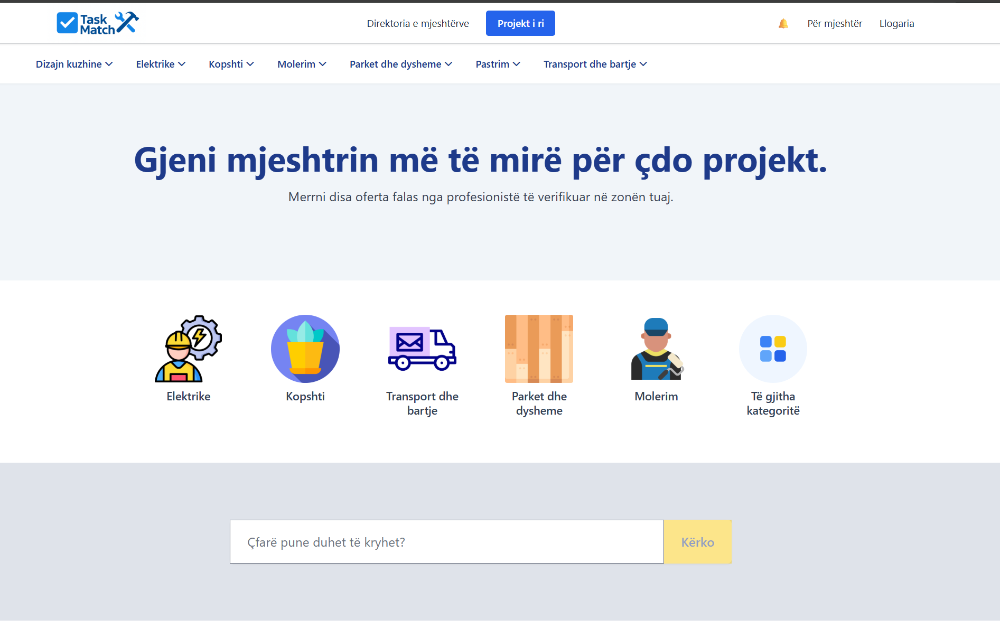
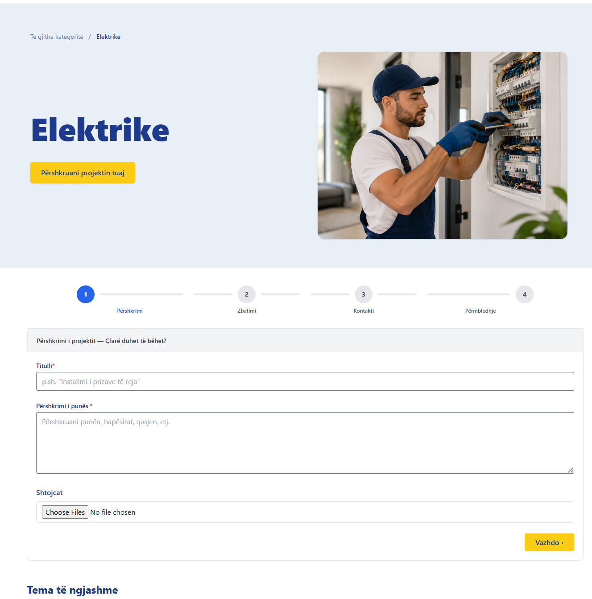
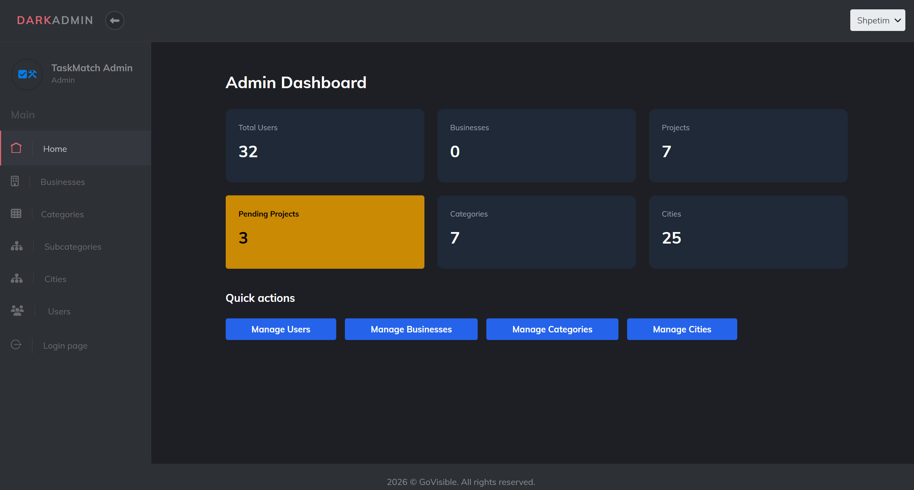
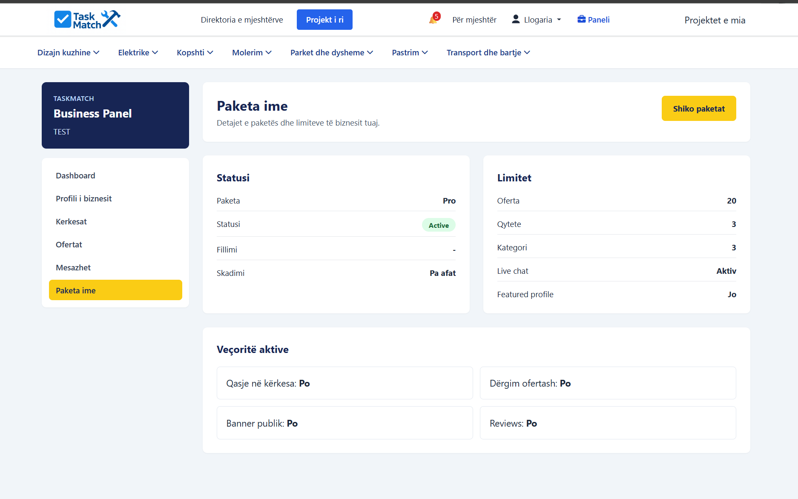
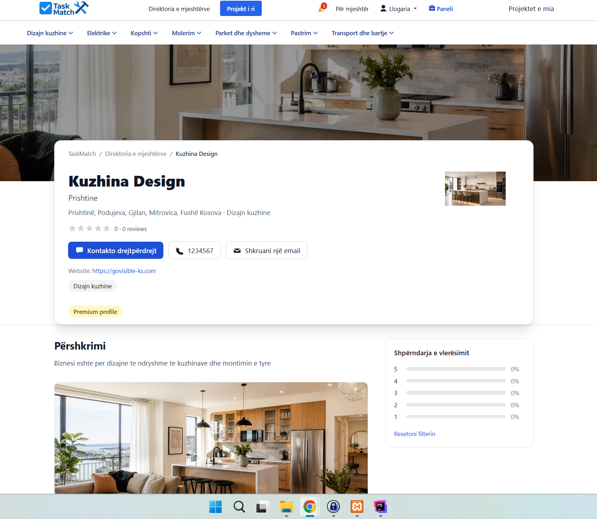

# TaskMatch Showcase

TaskMatch is a Laravel-based service marketplace built for Kosovo, connecting clients with service professionals and businesses.

The platform allows clients to create project requests, choose service categories, upload project details, and receive offers from professionals. Businesses can manage their profiles, packages, requests, offers, and communication through a dedicated business panel.

> Source code is private because this is a commercial project. This repository is used only as a portfolio showcase.

## Live Project

https://taskmatch-ks.com

## Tech Stack

- Laravel
- PHP
- MySQL
- Blade
- Tailwind CSS
- JavaScript
- Authentication
- Role-based access
- Email notifications
- File uploads

## Key Features

- Service marketplace for clients and professionals
- Category-based project request flow
- Multi-step project request forms
- File upload support for project images/documents
- Business profiles with services, categories, cities, reviews, and contact options
- Business panel for managing packages, requests, offers, and messages
- Admin dashboard for managing users, businesses, projects, categories, subcategories, and cities
- Business plan logic with package limits and feature access
- Approval workflows and admin moderation
- Responsive frontend and dashboard layouts

## My Responsibilities

- Designed and developed the Laravel backend structure
- Built the frontend pages using Blade, Tailwind CSS, and JavaScript
- Implemented multi-step project request workflow
- Created business profile and business panel functionality
- Developed package and plan-based business feature logic
- Built admin CRUD functionality for users, businesses, projects, categories, subcategories, and cities
- Implemented role-based access control, notifications, and file uploads
- Worked on deployment, testing, and platform improvements

## Screenshots

### Homepage

### Project Request Flow

### Admin Dashboard

### Business Panel Package

### Business Profile

## Project Status

TaskMatch is a live marketplace platform and continues to be improved with business onboarding, plan-based features, project requests, offers, messages, and admin management tools.
